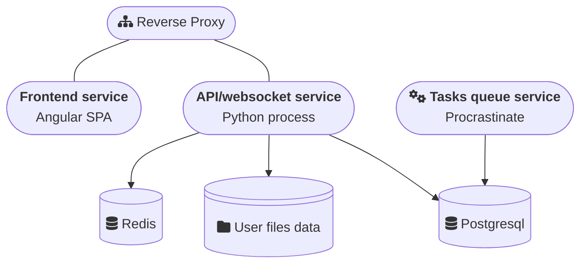

# Tenzu Architecture

## Introduction

This section describes the architecture of Tenzu and its main components. It provides an overview for system administrators to facilitate the deployment and management of the platform.

## Components

Tenzu is based on a modular architecture composed of the following elements:

- **Frontend**: Web application that interacts with users (provided as a Docker image).
- **Backend**: API and WebSocket (provided as a Docker image).
- **PostgreSQL**: Database.
- **Redis**: Broker for WebSockets.
- **Reverse Proxy**: Manages routing and security of incoming requests.
- **Task Queue**: Manages asynchronous tasks.

## Prerequisites
Before deploying Tenzu, ensure that your environment meets the following conditions:
- A container engine such as Docker or containerd.
- A PostgreSQL database (minimum required version: 14).
- A Redis instance (minimum required version: 7.1).
- A reverse proxy (caddy, traefik, nginx, apache ) responsible for proxying API/Websocket requests to the backend and Managing SSL certificates

## Diagramme de l'architecture

