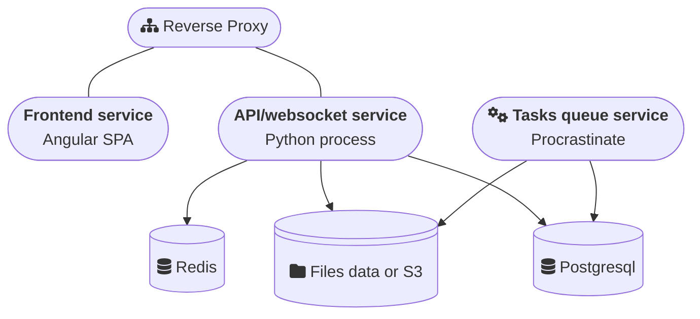

# Introduction

This is the technical documentation for Tenzu. We will provide some recipes to deploy using technology that we support.

This section describes the architecture of Tenzu and its main components. It provides an overview for system administrators to facilitate the deployment and management of the platform.
:::danger
Tenzu is not yet ready to be used in production environment.
We have some more updates incoming before then.
:::

## Components

Tenzu is based on a modular architecture composed of the following elements:

- **Frontend**: Web application that interacts with users (provided as a Docker image).
- **Backend**: API and WebSocket (provided as a Docker image).
- **PostgreSQL**: Database.
- **Redis**: Broker for WebSockets.
- **Reverse Proxy**: Manages routing and security of incoming requests.
- **Task Queue**: Manages asynchronous tasks.
- **S3**: Optional s3 backend for files storage.

## Prerequisites
At the very least you'll need:
- A container engine such as Docker or containerd.

Then, to deploy Tenzu, you'll need to ensure that your environment meets the following conditions:
- A PostgreSQL database (minimum required version: 14).
- A Redis instance (minimum required version: 7.1).
- A reverse proxy (caddy, traefik, nginx, apache, ...) responsible for proxying API/Websocket requests to the backend and Managing SSL certificates
- A SMTP server to deliver transactional mails

## Architecture diagram

